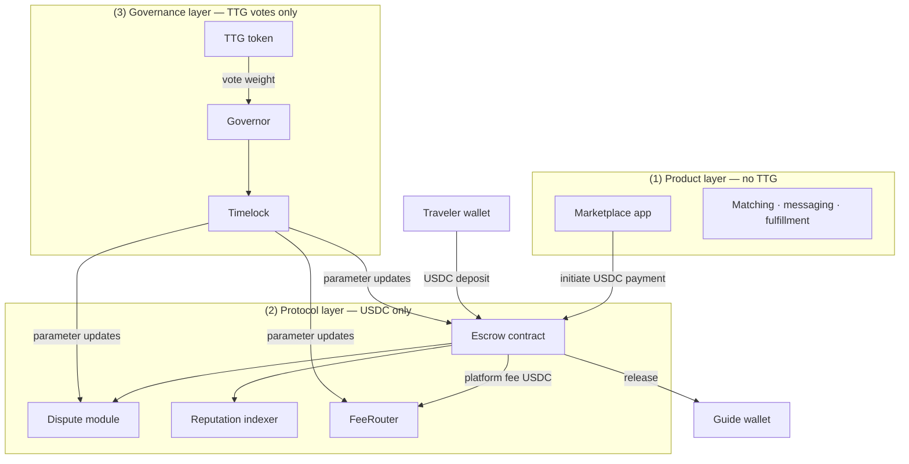

# TravelTrust — Protocol Verifiability Pack

**Document ID:** `12-Protocol-Verifiability-Pack.md`  
**Version:** 1.1-reg-safe · **As-of:** 2026-07-05 · Aligned with submission v6.0-reg-safe  
**Project:** TravelTrust  
**Audience:** Due diligence reviewers · listing compliance · technical audit  
**Stage:** Closed Beta — Sepolia testnet only · **Production mainnet:** not live  

> **Scope:** This document describes intended protocol architecture, current deployment status, and verifiable references. It is informational only. Not an offer. Materials may describe design ahead of on-chain deployment.

---

## Document map

| Section | Contents |
|---------|----------|
| §1 | Contract status table |
| §2 | System architecture — escrow, dispute, reputation, governance flows |
| §3 | Fund and asset separation |
| §4 | Verification links and references |
| §5 | Reviewer verification checklist |

**Related documents:** [`10-CryptoTotem-Submission-Compliance-FINAL.md`](./10-CryptoTotem-Submission-Compliance-FINAL.md) · [`00-METADATA-FINAL.md`](./00-METADATA-FINAL.md)

---

# §1. Contract status table

**Current environment:** Ethereum **Sepolia testnet** · Chain ID **11155111**  
**Production Ethereum mainnet:** **Not live** · mainnet deployment **TBD** (conditional on audit and legal clearance)

| Component | Target network | Deployment status | Contract address | Notes |
|-----------|----------------|-------------------|------------------|-------|
| **USDC order escrow** | Sepolia | **NOT DEPLOYED** | None (placeholder `0x0000…0000` in NDA data room) | Design documented; no production escrow address |
| **Dispute module** | Sepolia | **NOT DEPLOYED** | None | Dispute logic tied to escrow state machine; not deployed |
| **FeeRouter** | Sepolia | **NOT DEPLOYED** | None | Fee routing configuration documented; not deployed |
| **Protocol Treasury** | Sepolia | **NOT DEPLOYED** | None | Operational treasury separate from escrow principal |
| **TTG governance token** | Sepolia | **NOT DEPLOYED** | None | No scheduled deployment date |
| **Governor contract** | Sepolia | **NOT DEPLOYED** | None | Parameter voting module; not deployed |
| **Timelock contract** | Sepolia | **NOT DEPLOYED** | None | Delay layer for governance execution; not deployed |
| **TTG (mainnet)** | Ethereum mainnet | **NOT DEPLOYED** | None | No mainnet address published |
| **USDC order escrow (mainnet)** | Ethereum mainnet | **NOT DEPLOYED** | None | Mainnet TBD |
| **Trip settlement asset** | Product / protocol design | **Defined — USDC only** | N/A | TTG excluded from settlement path |
| **USDC (Sepolia test token)** | Sepolia | **Reference only** | `0x1c7D4B196Cb0C7B01d743Fbc6116a902379C7238` | Circle Sepolia USDC; not project-deployed |
| **Protocol test transactions** | Sepolia | **Testnet evidence only** | See §4 | Apr 2026 internal acceptance txs; **not** live order escrow |

### Status summary

| Category | Fact |
|----------|------|
| **Deployed (production)** | No order-escrow or TTG governance contracts on mainnet |
| **Deployed (testnet — project contracts)** | No project escrow, dispute, or TTG contracts on Sepolia |
| **Testnet activity** | Protocol test transactions exist; labeled test evidence only |
| **Production app** | None — Closed Beta demo only |
| **Mainnet timeline** | TBD — conditional |

---

# §2. System architecture

TravelTrust uses a **hybrid architecture**: product UX and messaging operate off-chain; fund finality and audit trails are intended to be reconstructable from on-chain protocol events via indexers.

Three operational domains are **architecturally separated**:

| Domain | Layer | Primary asset |
|--------|-------|---------------|
| Marketplace + fulfillment | Product | None (off-chain UX; USDC payment initiation) |
| Escrow + dispute + reputation | Protocol | **USDC** |
| Parameter + operations budget votes | Governance | **TTG** (vote weight only; non-financial) |

---

## 2.1 Escrow flow

**Purpose:** Hold trip order principal in USDC until release conditions are met.

**Settlement asset:** USDC only. TTG does not enter this flow.

**Intended state machine:**

```
Created → Funded → Active → Released
                ↘         ↘
                 Refunded  Dispute (see §2.2)
                ↘
                 Cancelled
```

| State | Description | On-chain event (intended) |
|-------|-------------|---------------------------|
| **Created** | Order record exists; escrow not yet funded | OrderCreated |
| **Funded** | Traveler deposits USDC into escrow contract | EscrowFunded |
| **Active** | Trip in progress; funds locked | EscrowActive |
| **Released** | Milestone or completion conditions met; USDC sent to guide | EscrowReleased |
| **Refunded** | Cancellation rules met; USDC returned to traveler | EscrowRefunded |
| **Cancelled** | Order terminated before or without full funding | EscrowCancelled |

**Fund path:**

```
Traveler wallet ──USDC──► Escrow contract ──USDC──► Guide wallet
```

**Indexer role:** Map on-chain escrow events to product order UI states for reconciliation.

**Current status:** State machine design-frozen in documentation. Escrow contract **not deployed** on Sepolia or mainnet.

---

## 2.2 Dispute flow

**Purpose:** Resolve disagreements over trip completion or fund release while escrow holds USDC principal.

**Settlement asset:** USDC (principal path). TTG does not participate in dispute fund movement.

**Trigger:** Dispute opened from an **Active** or pre-release escrow state.

**Intended state branches:**

```
Active → DisputeOpened → DisputeUnderReview → DisputeResolved → Released | Refunded
                                              ↘
                                               DisputeEscalated (off-chain process layer)
```

| Step | Description |
|------|-------------|
| **DisputeOpened** | Either party initiates dispute; escrow funds remain locked |
| **DisputeUnderReview** | Evidence submission window; escrow state frozen |
| **DisputeResolved** | Outcome recorded on-chain; USDC released to guide or refunded to traveler per ruling |
| **DisputeEscalated** | Human/process layer may apply where contract rules delegate off-chain review |

**Relationship to escrow:** Dispute module reads and writes escrow state. It does not hold TTG or substitute USDC.

**Current status:** Dispute module **not deployed**. Design documented; no production contract address.

---

## 2.3 Reputation flow

**Purpose:** Record guide and trip outcomes for matching and safety signals.

**Data source:** Protocol events from completed orders and dispute outcomes.

**Intended data inputs:**

| Event source | Reputation signal |
|--------------|-------------------|
| EscrowReleased (clean completion) | Positive completion record |
| DisputeResolved | Dispute outcome attached to participant records |
| DID verification checkpoint | Identity anchor linked to guide profile |

**Storage model (intended):** Reputation data anchored to on-chain protocol events and indexed for product display. **Not** derived from TTG balances or TTG transfers.

**DID role:** Guide identity verification checkpoints stored as product + protocol records. DID ownership is independent of TTG ownership.

**Current status:** Reputation indexing depends on deployed escrow/dispute contracts. With escrow **not deployed**, on-chain reputation records are **not live**.

---

## 2.4 Governance flow

**Purpose:** Adjust protocol parameters and approve protocol operations budgets.

**Mechanism:** TTG vote weight via Governor contract; execution delayed by Timelock.

**Settlement asset:** None for trip funds. TTG provides **vote weight only** — not payment.

**Intended flow:**

```
Proposal submitted → Voting period (governance participants) → Vote outcome
       → Timelock queue → Timelock delay → On-chain execution (parameter change or operations spend)
```

**Vote categories (intended):**

| Category | Examples | Affects user USDC in escrow? |
|----------|----------|------------------------------|
| **Protocol parameters** | Escrow policy version, dispute rule params, fee-router config, regional routing tables | No — configuration only |
| **Operations budgets** | Audit fees, security reviews, infrastructure costs | No — separate from escrow principal |
| **Regional governance rules** | Regional protocol configuration parameters within deployed scope | No |

**Explicit exclusion:** Governance votes do **not** authorize transfers to governance participants based on TTG ownership. Operations spends are protocol expenditures only.

**Current status:** TTG token, Governor, and Timelock contracts **not deployed**. Governance flow is documented design only.

---

## 2.5 Architecture diagram (logical)



---

# §3. Fund and asset separation

This section defines the three asset domains reviewers must not conflate.

## 3.1 User funds — USDC escrow

| Attribute | Value |
|-----------|-------|
| **Asset** | USDC |
| **Purpose** | Trip order principal — lock, release, refund |
| **Custody** | Escrow smart contract (when deployed) |
| **TTG involvement** | **None** |
| **Co-mingling rule** | User escrow USDC must not co-mingle with TTG treasury or TTG balances |

## 3.2 Protocol fees — USDC via FeeRouter

| Attribute | Value |
|-----------|-------|
| **Asset** | USDC (deducted from platform fee path — not trip principal substitution) |
| **Purpose** | Protocol fee routing to regional and global protocol treasuries (USDC) |
| **Routing (documented design)** | FeeRouter configuration subject to governance parameter votes after deployment |
| **TTG involvement** | **None in fee collection** — TTG may vote on FeeRouter **configuration parameters** only |
| **Relationship to escrow** | Fee path is separate from escrow lock/release of order principal |

**Note:** FeeRouter contract **not deployed**. Routing percentages describe intended design subject to governance parameter votes after deployment.

## 3.3 Governance token — TTG (non-financial)

| Attribute | Value |
|-----------|-------|
| **Asset** | TTG (TravelTrust Governance Token) |
| **Purpose** | Vote weight for protocol parameter and operations budget proposals |
| **Financial function** | **None** — not payment, not incentive, not economic-return asset |
| **Escrow involvement** | **None** — TTG never held in or routed through escrow |
| **Product access** | **Not required** — marketplace use does not require TTG |

## 3.4 Separation matrix

| Flow | USDC | TTG |
|------|------|-----|
| Traveler pays for trip | **Yes** | No |
| Guide receives trip payment | **Yes** | No |
| Escrow holds order principal | **Yes** | No |
| Dispute resolves fund movement | **Yes** | No |
| Platform fee routing | **Yes** | No |
| Vote on escrow policy version | No | **Yes (vote only)** |
| Vote on audit budget | No | **Yes (vote only)** |
| Product login / booking gate | No | No |

---

# §4. Verification links and references

## 4.1 Block explorer

| Label | URL | Notes |
|-------|-----|-------|
| Sepolia Etherscan (base) | https://sepolia.etherscan.io | Current test environment |

## 4.2 Protocol test transactions (Sepolia)

These transactions are **internal protocol test evidence** from Apr 2026. They are **not** production order-escrow operations.

| Label | URL | Date (on-chain) |
|-------|-----|-----------------|
| Protocol test tx — queue | https://sepolia.etherscan.io/tx/0xad86bf07c1fad58989492b8ebe14f9512bbc8ad91019abb07127403e430a4d9b | 2026-04-17 |
| Protocol test tx — execute | https://sepolia.etherscan.io/tx/0xab38ea7849e11dab449460b613083f074656736f08b8436f1e7d9396cf8afa1d | 2026-04-17 |

**Reviewer note:** Absence of a verified escrow contract address on Sepolia Etherscan confirms order escrow is **not deployed**.

## 4.3 Reference token (Sepolia USDC)

| Label | Address | Notes |
|-------|---------|-------|
| USDC (Sepolia test token) | `0x1c7D4B196Cb0C7B01d743Fbc6116a902379C7238` | Third-party testnet USDC; reference for integration testing only |

## 4.4 Product demo (non-production)

| Asset | Path | Label |
|-------|------|-------|
| Product demo video | `demo/TravelTrust-Product-Demo-v1.3.mp4` | **Closed Beta — not production** |
| Demo brief (maintainer) | `demo/SCREEN-RECORDING-BRIEF.txt` | Specifies demo/testnet labeling requirements |

**Demo scope:** ~90s walkthrough showing marketplace → order → escrow state visibility. Demo environment is not a production deployment. No public production app URL exists.

## 4.5 NDA data room (contract files)

| File | Contents | Access |
|------|----------|--------|
| `contracts/escrow-contract-address.txt` | Escrow placeholder / deployment record | NDA data room |
| `contracts/testnet-links.txt` | Testnet reference index | NDA data room |

## 4.6 Technical documentation (via project contact)

| Document | Filename |
|----------|----------|
| Litepaper | `05-Litepaper-v1.3-EN.pdf` |
| Whitepaper | `06-Whitepaper-v1.3-EN.pdf` |
| Governance design | `07-Protocol-Tokenomics-v1.3-EN.pdf` |

**Request:** traveltrust.ir@gmail.com (project contact)

---

# §5. Reviewer verification checklist

Use this checklist to confirm stated facts against verifiable sources.

| # | Check | Expected result | Source |
|---|-------|-----------------|--------|
| 1 | Escrow contract address on Sepolia | **None published** — not deployed | §1 table; Sepolia Etherscan |
| 2 | TTG contract address on Sepolia or mainnet | **None published** — not deployed | §1 table |
| 3 | Trip settlement asset | **USDC only** | §3.1 |
| 4 | TTG in escrow payment path | **Excluded** | §3.4 matrix |
| 5 | Protocol test txs exist | Yes — labeled test evidence | §4.2 links |
| 6 | Production mainnet live | **No** | §1 status summary |
| 7 | Production app URL | **None** | §4.4 |
| 8 | Demo labeled non-production | **Yes — required** | §4.4 |

---

## Document footer

```
TravelTrust · Protocol Verifiability Pack v1.0
Environment: Sepolia testnet (11155111) · Mainnet: not live
Escrow: NOT DEPLOYED · TTG: NOT DEPLOYED · Settlement: USDC only
Informational only · Not an offer · Project contact: traveltrust.ir@gmail.com
```

---

*TravelTrust · Protocol Verifiability Pack · v1.0 · 2026-07-05*
