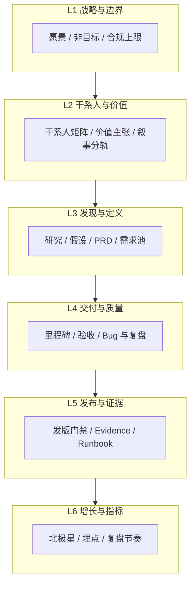
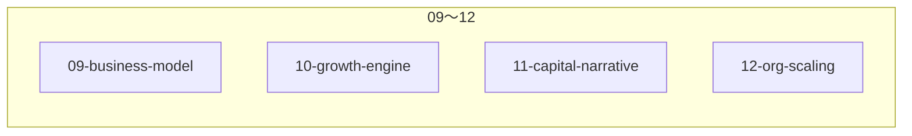
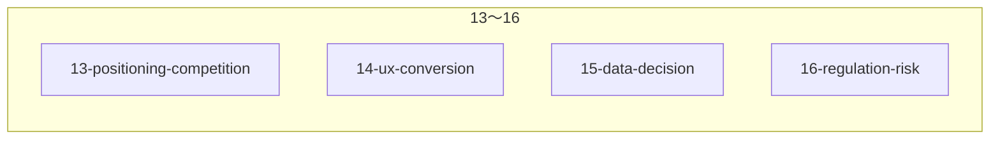
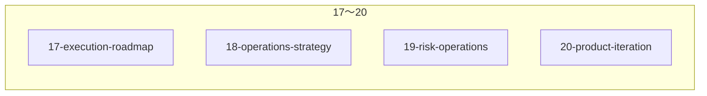
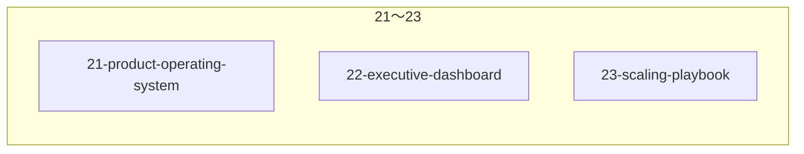
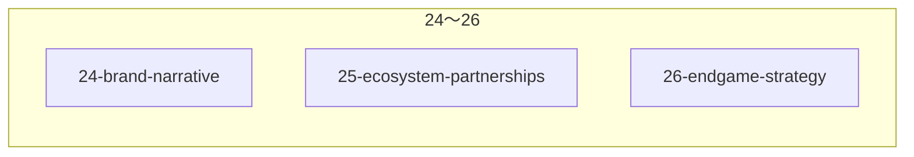

# 00 — 架构总览与多维干系人地图

**文档类型**：PM Office 总纲  
**状态**：生产级框架（随项目演进更新）  
**受众**：产品负责人、工程负责人、法务与增长接口人

**一句话定位**：**PM Office = 公司级产品操作系统** —— **不是**文档库、**不是** Wiki 合集、**不是** PPT；是 **决策 + 执行 + 验证** 并与 **`spec/`** 对齐的运行机制（详见 **`README.md`** 文首）。

---

## 1. PM 操作系统分层（逻辑架构）

本项目的 **产品管理** 按 **交付主线六层** + **核心支柱（09～26）** + **扩展支柱（`27`～`36`，见 `README` 文档树与 `PM-MASTER` 阶段 12）** 理解：支柱可并行迭代，**不可逆穿**交付链的合规与发版门禁（**`spec/15` 附录〇** = 工程发版 SSOT，非 Office `15-data-decision`）。

### 1.1 交付主线（L1～L6）

| 层级 | 本 Office 落点 | 工程 SSOT 锚点（示例） |
|------|----------------|------------------------|
| L1 | `01-strategy/` | `spec/01`、`spec/08-1`、`spec/08-4` |
| L2 | `02-stakeholders/` | `spec/87`、`spec/81`～`84`、`spec/82` |
| L3 | `03-discovery/`、`04-definition/` | `spec/03`、`spec/53`、`spec/17` |
| L4 | `06-delivery-release/`（与执行协同） | `spec/07`、`spec/27`、`spec/93` |
| L5 | `06-delivery-release/` | `spec/15` 附录〇、`go-live-checklist.md`、`ops/RUNBOOK.md` |
| L6 | `07-metrics-growth/` + **`15-data-decision/`** + **`22-executive-dashboard/`** | **度量**见 `07`；**用数据决策、实验、阈值**见 **`15`**；**经营层北极星与复盘一页纸**见 **`22`**（勿与 `spec/15`、`spec/22` 混淆） |

### 1.2 支柱 A：商业 / 增长 / 资本 / 组织（09～12）

与 **L1～L6** 正交。

| 支柱 | 目录 | 回答的核心问题 | 备注 |
|------|------|----------------|------|
| **商业模型** | **`09-business-model/`** | take rate、GMV→Revenue、LTV/CAC | 与 **`spec/83`**「分配」解耦 |
| **增长引擎** | **`10-growth-engine/`** | 0→10 万用户的 **机制** | 与 **`07`/`15`** 闭环 |
| **融资叙事** | **`11-capital-narrative/`** | TAM、Why now、轮次 | 竞品 **摘要** 指向 **13** |
| **组织扩张** | **`12-org-scaling/`** | 城市、RACI、成本、业务 KPI | |

### 1.3 支柱 B：定位与竞争 / UX 转化 / 数据决策 / 合规风险（13～16）

回答 **「Why you will win?」**、**「用户怎么用」**、**「怎么优化增长」**、**「跨境金融旅游 Web3 风险地图」**。

| 支柱 | 目录 | VC / 市场典型问题 | 与 `spec` 关系 |
|------|------|-------------------|----------------|
| **竞争与定位** | **`13-positioning-competition/`** | **Why you will win?** 结构化竞品、替代方案、护城河拆解 | **不替代** `11` 故事；**`11/03`** 叙事摘要 → **13** 为矩阵 SSOT |
| **UX 与转化** | **`14-ux-conversion/`** | 系统对了但 **用户会不会用**；Web2→Web3 | 落地须符 **`spec/13`、`13-1`、`05`、`06`** |
| **数据与决策** | **`15-data-decision/`** | **怎么优化增长**；北极星、阈值、A/B、实验 | **`spec/15`** = 发版检查报告；**本 15** = 产品决策体系（README 内防呆表） |
| **合规与风险** | **`16-regulation-risk/`** | 美/港/新 DD；KYC/AML/资金预案 | **`spec/08-*`** 为真值；本层为 **PM 索引与占位矩阵** |

### 1.4 支柱 C：执行、运营实战、运营风险、产品迭代（17～20）

回答 **「团队怎么一步步做完」**、**「怎么真把用户拉进来」**、**「出事运营怎么办」**、**「怎么持续迭代」**。

| 支柱 | 目录 | 典型问题 | 与 `spec` 防呆 |
|------|------|----------|----------------|
| **执行与项目** | **`17-execution-roadmap/`** | 6～12 月产品路线、MVP→PMF→Scale、P0/P1/P2、人月 | **≠ `spec/17`（MVP 清单）**；接口 **`spec/07`** |
| **运营策略** | **`18-operations-strategy/`** | 城市 0→100 单、招募、本地 SOP | **≠ `spec/18`（架构图）** |
| **运营风险** | **`19-risk-operations/`** | 资金异常话术、争议工单、投诉升级 | **≠ `spec/19`（Escrow 参数图）**；技术恢复 **`Runbook`** |
| **产品迭代** | **`20-product-iteration/`** | 反馈、Sprint、Feature 调整、PM 升级 | **≠ `spec/20`（云架构）** |

### 1.5 支柱 D：产品控制中枢、经营驾驶舱、规模化复制（21～23）

回答 **「跨模块谁说了算」**、**「CEO/VC 一眼看什么」**、**「怎么把一城打法封包复制」**。

| 支柱 | 目录 | 典型问题 | 与 `spec` 防呆 |
|------|------|----------|----------------|
| **产品控制中枢** | **`21-product-operating-system/`** | 增长 vs 风控 vs 收入 vs UX 谁优先；冲突升级；PM 边界 | **≠ `spec/21`（UI/3D 融合规范）** |
| **经营驾驶舱** | **`22-executive-dashboard/`** | 唯一北极星、KPI 树、订单/资金/争议监控、周月复盘 | **≠ `spec/22`（Design Tokens）** |
| **规模化复制** | **`23-scaling-playbook/`** | 试点门禁、城市包母版、handover 验收 | **≠ `spec/23`（Figma/UI 交付物）** |

### 1.6 支柱 E：品牌叙事、生态合作、终局与退出（24～26）

回答 **「用户凭什么记住你」**、**「网络怎么长出来」**、**「长期价值与退出叙事是否自洽」**。

| 支柱 | 目录 | 典型问题 | 与 `spec` 防呆 |
|------|------|----------|----------------|
| **品牌与市场叙事** | **`24-brand-narrative/`** | 核心一句话、心智、托管信任、PR/KOL/Web3 传播 | **≠ `spec/24`（文档企业级整理结论）** |
| **生态与合作** | **`25-ecosystem-partnerships/`** | OTA、机构供给、钱包/DID、支付合规伙伴 | **≠ `spec/25`（顶级 UI 标准）** |
| **终局与退出** | **`26-endgame-strategy/`** | IPO/Token/并购、网络效应、价值捕获 | **≠ `spec/26`（文档审计报告）** |

### 1.7 横切层：系统闭环与控制权（关键补充）

> 横切层解决 **「信息怎么流」**；**最终谁拍板** 必须写死，否则增长 / 风控 / UX 会在会议里无限拉扯。

| 横切文档 / 目录 | 作用 | 是否拥有「决策权」 |
|-----------------|------|-------------------|
| **`02-系统联动规则与模块Impact-Map.md`** | 定义跨模块 **影响范围**与三元组门禁 | ❌ **无决策权**（仅约束：无 Impact 不得合 PRD） |
| **`99-real-world-validation/`** | 真人、试点、GMV/漏斗 **证据与回写**（**≠ `spec/27-P*`**） | ❌ **无决策权**（仅输入 / 证伪假设） |
| **`21-product-operating-system/`** | 冲突仲裁、优先级、**决策栈** | ✅ **唯一产品决策出口** |
| **`22-executive-dashboard/`** | 指标与经营结果、红项告警 | ❌ **不直接决策**；仅 **触发** 下钻分析或上会 |
| **`15-data-decision/`** | 实验设计、归因、阈值建议 | ❌ **不直接决策**；仅 **建议**（是否开实验 / 放量由 **`21`** 裁定） |

**最终原则**：所有冲突（**增长 vs 风控**、**UX vs 收入**、叙事 vs 合规等）**必须收敛到 `21-product-operating-system`** 书面决策栈；**`02`** 与 **`99`** 不得被误用为「谁声音大谁赢」的替代裁判。

**执行飞轮（带触发规则，与支柱正交）**：

1. **`22`** — 指标 **异常 / 达标**（North Star 或 KPI 叶触发条件写清）  
   ↓（**触发**：满足阈值或连续 N 周趋势）  
2. **`15`** — **实验** 或 **归因分析**（假设可证伪）  
   ↓（**触发**：实验方案过门禁 + **`21`** 授权资源）  
3. **`21`** — **继续 / 停止 / 放大**（唯一决策）  
   ↓（**决策**书面输出）  
4. **`17` / `18` / `14`**（及依赖的 **`06`** 等）— **执行**  
   ↓  
5. **`99`** — 真实世界验证  
   ↓（**强制回写**：结论进 **`20`** / **`03`** / 假设日志）  
6. **`03` / `20` / `01`** — 需求池、迭代排期、战略与契约对齐  

**纪律**：**没有触发条件的动作，一律不允许进入执行**（无 **`22`** 信号则无 **`15`** 立项；无 **`21`** 裁决则无 **`17`～`18`** 资源承诺）。

**支撑节奏（非飞轮主链，但须对齐）**：**`22/04`**（NS+KPI 绑定表）· **`15/05`～`06`**（实验流程 SSOT）· **`21/04`**（统一优先级截断）· **`12/04`**（资源与预算）· **`08-operations-pm/cadence/`**（周/月/季）· **`99/05`**（反馈贯穿 **99→03→20→01**）· **`09/05`**（现金流七步）。

### 1.8 五套「企业级操作系统」补件（与 §1.7 正交）

> **§1.7** 解决 **控制权与飞轮**；下表解决 **「怎么算、谁出人、出事怎么办、谁背锅、周月季做什么」** —— 缺一不可，否则仍会退化为 **会议政治**。

| 系统 | 回答的问题 | SSOT 文档 |
|------|------------|-----------|
| **决策引擎（Decision Engine）** | **怎么做决策**、为何排序如此；**量化**比较 | **`21-product-operating-system/05-决策引擎-Priority-Score-量化模型与系统驱动.md`** |
| **资源分配板（Resource Allocation Board）** | **谁来做、多少人天、谁被推迟**；与 **`21`** 裁决绑定 | **`12-org-scaling/05-Resource-Allocation-Board-资源分配板.md`** |
| **异常响应（Incident / Failure Loop）** | **出事时** War Room、**`15` 冻结**、**`21` 临时栈**、**`22` 日更**、退出条件 | **`21-product-operating-system/06-Incident-Response-Failure-Loop-异常响应.md`** |
| **责任闭环（Accountability）** | **KPI → 唯一 Owner → Review**；实验失败复盘谁牵头 | **`22-executive-dashboard/05-KPI-Owner-Accountability-强绑定与Review.md`** |
| **节奏系统（Cadence System）** | **周** 实验+指标、**月** 栈微调、**季** 资源重算 | **`08-operations-pm/cadence/00-Operating-Cadence-周月季战略.md`** §2 |

### 1.9 战略进化、护城河与真现金（第二组补件）

> 解决 **「方向错了仍优化」「壁垒说不清」「GMV 好但公司没钱」**。

| 系统 | 回答的问题 | SSOT 文档 |
|------|------------|-----------|
| **战略进化（Strategy Kill / Pivot）** | **何时推翻战略**；强制 Review → 重写 **`01-strategy`** → 重排 **`21`** | **`01-strategy/02-Strategy-Kill-Pivot与战略进化闭环.md`** |
| **护城河建设（Moat System）** | **别人为何难以复制**；数据 / 网络 / 供给 / 技术 / 合规 **五类自检** | **`13-positioning-competition/05-Moat-Construction-System护城河建设.md`** |
| **现金转化闭环（Cash Conversion Loop）** | **钱是否真进来**；回款、退款、资金占用、burn | **`09-business-model/06-Cash-Conversion-Loop现金转化闭环.md`** |

### 1.10 违规成本、会议 OS、权限与上手（执行层）

| 系统 | 回答的问题 | SSOT 文档 |
|------|------------|-----------|
| **违规成本（Violation Cost）** | **违反规则会怎样**；**谁当场执行、如何记 log** | **`01` §2.5～§2.5.1**、**`_registry/违规记录.md`** |
| **会议 OS（Meeting OS）** | **哪场会执行哪条规则**；谁卡点 R1～R6 / Impact / `22` / `21` / `99` | **`08-operations-pm/meetings/01-Meeting-OS-规则与会议绑定.md`** |
| **权限边界（强执行）** | **谁有权改 spec / PRD / 商业 / 上线** | **`_registry/权限边界-强执行.md`** |
| **新成员上手（Onboarding）** | **Day1 / Day3 / Day7 / Day30** 读什么、交什么作业 | **`_registry/新成员上手路径-Day1-Day7-Day30.md`** |

### 1.11 产品边界三句话（全员口径）

与 **`01-与工程-spec-SSOT-对齐契约.md`** 文首 **完全一致**，便于 **开会先念一遍**：

1. **不定义技术真值** —— **`spec/`**。  
2. **不绕过资金语义** —— **`spec/`** 与 **链上**。  
3. **不单模块拍板** —— **`02` Impact Map** + **`21`**。  

**其余**皆可讨论与迭代；**违规当场处置与记 log** 见 **`_registry/违规记录.md`**。

### 1.12 灰度、每日执行、组织绑定、反官僚

| 机制 | SSOT |
|------|------|
| **`spec` 未覆盖但必须上线** | **`01` §2.4** 灰度（PRD **Gray** + **`_registry`** + **48h** 补 `spec`） |
| **谁在跑系统** | **`_registry/执行检查清单-每日版.md`** |
| **规则绑到人** | **`_registry/规则绑定与执行责任.md`** |
| **防写文档上瘾** | **`_registry/反官僚原则.md`** |

---

## 2. 多维干系人（Stakeholder）索引

**详细展开**：`02-stakeholders/` 各篇 + **`02-stakeholders/00-干系人全景矩阵-权力兴趣.md`**；**决策权（DACI/RAPID/RACI）** **`02-stakeholders/08-决策权力边界-DACI-RAPID-RACI与通知矩阵.md`**；**扩展干系人占位** **`02-stakeholders/09-扩展干系人-数据支付保险政府-T&S-占位.md`**。

| 维度 | 代表对象 | Office 路径 |
|------|----------|-------------|
| **个人（C 端）** | 旅行者 / 终端用户 | `02-stakeholders/01-个人旅行者-C端.md` + **`14-ux-conversion/`** |
| **供给（B 端）** | 向导、服务商（`provider`） | `02-stakeholders/02-向导与服务商-B端供给.md` |
| **资本** | 机构投资人、LP、生态出资方 | `02-stakeholders/03-投资人-机构-LP.md` + **`11-capital-narrative/`** + **`13-positioning-competition/`** + **`26-endgame-strategy/`** |
| **区域与合作** | 区域运营、合作渠道 | `02-stakeholders/04-区域与合作方.md` + **`12-org-scaling/`** + **`25-ecosystem-partnerships/`** |
| **合规与监管** | 法务、合规、审计接口 | `02-stakeholders/05-监管合规与法务接口.md` + **`16-regulation-risk/`** |
| **舆论与社区** | 媒体、KOL、社区用户 | `02-stakeholders/06-社区与媒体.md` + **`10-growth-engine/04`** + **`24-brand-narrative/`** |
| **内部** | 工程、运维、数据、安全 | `02-stakeholders/07-内部工程与运维.md` + **`17-execution-roadmap/`**、**`20-product-iteration/`**、**`21-product-operating-system/`**、**`22-executive-dashboard/`** |
| **管理层** | CEO / 董事会观察员 | **`22-executive-dashboard/`**、**`21-product-operating-system/01`**（当季决策栈）、**`26-endgame-strategy/00`**（终局披露门禁） |

---

## 3. 产品主链（Happy Path）一句话（防话术漂移）

**链下确认行程完成（非放款）→ 行后评分（若适用）→ 链上 release。**  
与 `spec/01` §〇、`spec/11` §二附、`spec/15` 附录〇 **W3** 一致；对外培训与 PRD 须引用此句。

---

## 4. 变更记录

| 版本 | 日期 | 说明 |
|------|------|------|
| 0.1.0 | 2026-05-02 | 初版：PM Office 目录与分层总纲 |
| 0.2.0 | 2026-05-02 | 增补 **09～12** 四大支柱与与 **83** 边界说明 |
| 0.3.0 | 2026-05-02 | 增补 **13～16**（定位竞争、UX 转化、数据决策、合规风险）；**L6** 与 **`15-data-decision`** 关系；**`spec/15` vs Office-15** 防呆 |
| 0.4.0 | 2026-05-02 | 增补 **17～20**（执行路线、运营打法、运营风险 SOP、迭代）；**`spec/17`～`spec/20`** 与 Office 同名防呆 |
| 0.5.0 | 2026-05-02 | 增补 **21～23**（产品控制中枢、经营驾驶舱、规模化复制）；**`spec/21`～`spec/23`** 与 Office 同名防呆；**L6** 纳入 **`22`** |
| 0.6.0 | 2026-05-02 | 增补 **24～26**（品牌叙事、生态合作、终局与退出）；**`spec/24`～`spec/26`** 与 Office 同名防呆 |
| 0.7.0 | 2026-05-02 | 增补 **§1.7**：根目录 **`02` 联动规则**、**`99` 真实世界验证** 横切层 |
| 0.8.0 | 2026-05-02 | 增补 **执行飞轮**：**`22/04`**、**`15/05`～`06`**、**`21/04`**、**`12/04`**、**`08/cadence`**、**`99/05`**、**`09/05`** |
| 0.9.0 | 2026-05-02 | **§1.7** 强化闭环 **控制权**（决策权表 + 冲突收敛至 **`21`**）；**执行飞轮** 增补 **触发规则** 与「无触发不执行」纪律 |
| 1.0.0 | 2026-05-02 | 新增 **§1.8**：决策引擎、资源板、Failure Loop、KPI–Owner、Cadence 五套补件索引 |
| 1.1.0 | 2026-05-02 | 新增 **§1.9**：Strategy Kill/Pivot、**Moat** 建设系统、**Cash Conversion Loop** 索引 |
| 1.2.0 | 2026-05-02 | 新增 **§1.10**：Violation Cost、Meeting OS、**权限**、**Onboarding** 索引 |
| 1.3.0 | 2026-05-02 | **§1.11** 产品边界三句话；**§1.10** 违规列链 **`违规记录.md`** |
| 1.4.0 | 2026-05-02 | 文首 **一句话定位**；**§1.12** 灰度/每日/绑定/反官僚索引 |
| 1.5.0 | 2026-05-05 | **§2** 干系人详细展开链 **`02/08`**（决策权）、**`02/09`**（扩展接口） |
| 1.6.0 | 2026-05-06 | **§1** 增补 **扩展支柱 `27`～`36`** 与 **`PM-MASTER` 阶段 12** 对齐说明 |

---

**Owner**：PM-O  
**更新日期**：2026-05-06  
**下次评审**：季
