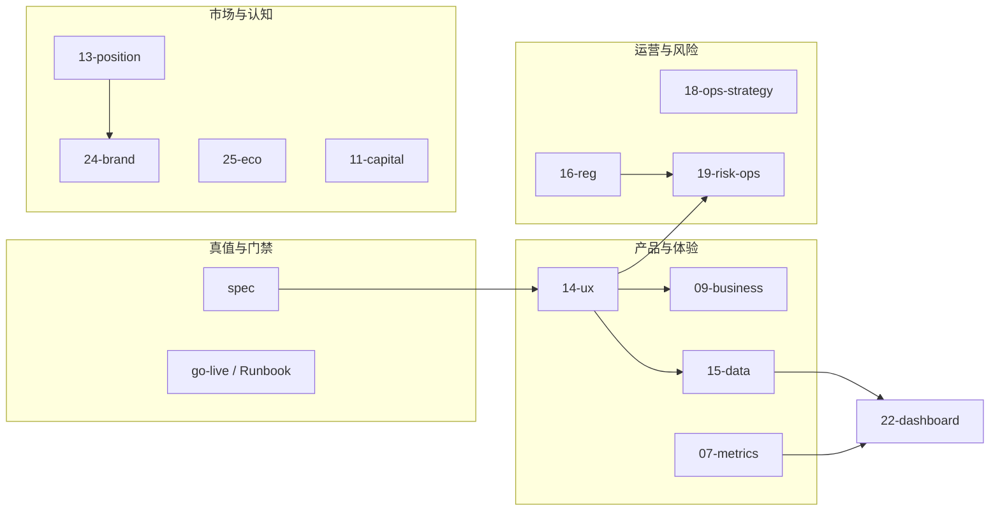

# 02 — 系统联动规则与模块 Impact Map（System Integration Layer）

**性质**：PM Office **跨模块联动契约** —— 解决「单模块文档都完整，但 **改一处不知会震哪几处**」；**不**替代 **`spec/`** 技术 SSOT，与 **`01-与工程-spec-SSOT-对齐契约.md`** 并列阅读。

---

## 1. 每条需求 / 每份支柱文档变更必须标注的三元组

| 字段 | 含义 | 最低要求 |
|------|------|----------|
| **输入自** | 本结论依赖哪些 Office / `spec` | 列 **路径**；无则写 **「无新增外部输入」** |
| **输出至** | 生效后 **必须同步** 的模块（叙事、SOP、指标、门禁） | 列 **路径**；若仅工程变更写 **`spec` 锚点** |
| **修改影响链（Impact Map）** | 从本变更沿 **用户路径 / 资金路径 / 数据路径** 的 **下游检查清单** | 至少 **3 条** 可勾选项；**须标注 Impact 等级（§1.2）** |

### 1.2 Impact 等级（量化影响幅度）

| 等级 | 定义 | 会议 / 升级 |
|------|------|-------------|
| **L1** | 轻微：仅 **单篇文档** 或 **局部文案**，无跨模块依赖 | 需求评审内消化 |
| **L2** | 中等：明确影响 **1～2 个** Office 支柱或单一职能团队 | **方案评审会** + 完整三元组 |
| **L3** | 重大：触及 **资金语义 / 核心转化 / 合规对外叙事** 之一 | **必须**有 **`21`**（当季栈或 **`21/02`** 升级）**书面结论**，否则 **方案评审不得通过** |
| **L4** | 系统级：NS、战略栈、多区域/多伙伴 **同时改写** | **必须** **`21`** + 纪要；适用时 **记 `违规记录.md`** |

**会议纪律（强制）**：凡落入 **本条所约束的「需求 / 支柱文档变更」**（跨模块、或触及 **用户路径 / 资金路径 / 数据路径 / 对外叙事**），**未带齐三元组（输入自 / 输出至 / Impact Map ≥3 条）= 该次评审不得作出「通过」结论** —— **零例外**（**禁止**「先上会、后补 Impact」）。仅 **纯错别字 / 格式** 类变更可豁免。**哪场会谁卡点** 见 **`08/meetings/01-Meeting-OS-规则与会议绑定.md`**；**当场记录** 见 **`_registry/违规记录.md`**；**后果** 见 **`01` 契约 §2.5～§2.5.1**。

---

## 2. 总依赖示意（逻辑，非部署图）

---

## 3. 高频 Impact 链（真实问题索引）

| 你改了… | 必须额外过一遍… | 典型原因 |
|---------|-----------------|----------|
| **`14-ux-conversion`**（流程/步骤/文案） | **`19-risk-operations`**（工单话术、升级条件）、**`09-business-model`**（漏斗→收入假设）、**`24-brand-narrative`**（托管叙事）、**`15-data-decision`**（实验分流面）、**`spec/04`§3.4**（若动 API） | UX 变 = 风险触点与转化口径一起变 |
| **`09-business-model`**（抽佣、GMV 口径） | **`11`/`26`**、**`05-go-to-market/00`**、**`22`**、**`spec/08-4`** | 对外与内部看板同源 |
| **`18-operations-strategy`**（城市 SOP） | **`19`**、**`07`**（埋点事件）、**`23`**（封包）、**`25`**（伙伴承诺） | 落地执行牵动证据与合规话术 |
| **`16-regulation-risk`**（辖区/AML/**`16/05`**/**Penta**/赔付表） | **`19`**、**`24`**、**`05`**、**`11/06`**、**`15/06`**、**`14/03～04`**、**`26/02`（Token）** | 合规上沿影响所有对外嘴形；**未签 Memo** → **`17/02`§4.1** 级 **P0**；**路演** 须过 **`11/06` B4/D4** |
| **`17-execution-roadmap`**（P0 重排） | **`06-delivery-release`**、**`20`**、**`spec/07`** Wave | 路线 = 发版与迭代契约 |

### 3.1 真实高频链路案例（交易 + 信任）

以下三条为 **定性示意**（比例仅供评审时对齐 Impact，**非**承诺指标）；用于 PRD 评审时快速对照 **`02`** 三元组是否写全。

#### 案例 1：UX 改动 → 争议暴增（`14` → `19`）

**【案例】** 简化下单流程：由 **5 步 → 3 步**，并移除独立「条款确认页」。

| 维度 | 内容 |
|------|------|
| **变更** | 减少确认摩擦 |
| **可能结果** | 转化率 **↑**（示意）；争议率 **↑**（用户声称未充分知情） |
| **Impact** | **`19-risk-operations`**：工单与升级激增；**`24-brand-narrative`**：「被坑」心智；**`09-business-model`**：退款与客服成本侵蚀 take rate 假设 |
| **结论** | UX 优化 **须同步** 风险 SOP、条款展示与 **`19`** 话术；否则视为 **Impact Map 不完整** |

#### 案例 2：商业模型调整 → 数据与融资口径冲突（`09` → `22` → `11`）

**【案例】** 平台抽佣由 **10% → 15%**。

| 维度 | 内容 |
|------|------|
| **变更** | 提高平台货币化 |
| **可能结果** | **`22`**：Revenue 口径变化；**`07-metrics-growth`** / **`14`**：漏斗或转化 **承压** |
| **Impact** | **`11-capital-narrative`**：增长叙事 vs 盈利叙事是否自洽；**`24-brand-narrative`**：用户侧「变贵」感知；**`10-growth-engine`**：是否需补贴或机制对冲 |
| **结论** | 商业模型 = **必须同步** 增长、看板与融资材料；**`05-go-to-market`** 数字门禁重过 |

#### 案例 3：合规策略变更 → 全链路重写（`16` → ALL）

**【案例】** 新增 **强制 KYC** 后方可下单。

| 维度 | 内容 |
|------|------|
| **变更** | 合规上沿抬高 |
| **可能结果** | **`14-ux-conversion`**：流程摩擦 **显著上升**；拉新与激活成本变化 |
| **Impact** | **`10-growth-engine`**、**`24-brand-narrative`**（心智从「自由」→「合规平台」）、**`09-business-model`**（短期收入路径）、**`18`/`19`**（运营话术与异常）、必要时 **`25`/`26`** 披露 |
| **结论** | 合规 = **系统级 Impact**，不是单模块 PRD；须 **`21`** 决策栈明确当季取舍，并回写 **`01`/`spec/08-*`** |

---

## 4. 分模块索引（输入 / 输出 / 修改时 Impact）

以下每条 **变更后** 须在 PR 描述或 `_registry` 留 **一行** 指向本表对应小节。

### 4.0 `01-strategy`

| 输入自 | 输出至 |
|--------|--------|
| **`22`**（NS 趋势）、**`09/02`**（单位经济）、**`99`**（假设证伪）、**`16`**（合规边界） | **`01/00`～`01`** 愿景与路线、**`21/01`** 栈、**`17`** Wave 接口、**`11`/`05`** 对外叙事 |

**Impact Map（勾选）**：是否触发 **`01/02` Strategy Kill**；**`22/04`** 是否删无关 KPI 叶；**`15/06`** 实验是否 **停/改**；**`12/05`** 人天池是否重算。

### 4.1 `09-business-model`

| 输入自 | 输出至 |
|--------|--------|
| `13`、`22`、`07`、**`spec/08-4`** | `11`、`22`、`26`、`05`（对外数字） |

**Impact Map（勾选）**：`22/01` KPI 叶是否仍成立；`11` 路演数字是否冲突；`26/04` 价值捕获叙事是否需改；`05/00` 门禁是否重过。**`09/06`** 现金链与 **回款/退款/占用/burn** 是否仍成立。

### 4.2 `10-growth-engine`

| 输入自 | 输出至 |
|--------|--------|
| `15`、`21`、`24` | `18`、`14`、`07`（新机制须有新埋点） |

**Impact Map**：`18` SOP 是否可执行；补贴/裂变是否触碰 `16`；`21/00` 原则栈是否仍满足。

### 4.3 `11-capital-narrative`

| 输入自 | 输出至 |
|--------|--------|
| `09`、`13`、`22`、`25`、`26` | `05`、**`product-manager/`** 执行稿 |

**Impact Map**：`24` 用户叙事是否打架；`spec/82`～`84` 与 **`08-4`**；Data Room 索引是否更新。

### 4.4 `12-org-scaling`

| 输入自 | 输出至 |
|--------|--------|
| `17`、`23`、`25` | `18`、`22`（组织 KPI）、`02-stakeholders` |

**Impact Map**：`23` 封包 RACI；`25` 伙伴 owner 是否与人头匹配。**`12/05`** 人天池与 **`21/05`** 是否 **同序**。

### 4.5 `13-positioning-competition`

| 输入自 | 输出至 |
|--------|--------|
| `01`、`spec/01` | `11`、`24`、`26`、`14`（差异化落到步骤） |

**Impact Map**：`24/00` 一句话是否仍真；`14` 信任证据是否需补 UI。**`13/05`** Moat 五类是否需 **降级/加深** 叙事。

### 4.6 `14-ux-conversion`（示例：弱连接 → 强连接）

| 输入自 | 输出至 |
|--------|--------|
| `13`、`24`、**`spec/13`、`spec/13-1`、`spec/04`** | `15`（漏斗/实验）、`19`（工单与争议陪伴）、`09`（转化→钱）、`07`（埋点）、`24`（托管表述） |

**Impact Map**：**`19`**：新卡点是否需新 SOP / SLA；**`09`**：每步转化率假设是否重算；**`15`**：A/B 面是否碎裂；**`spec/04`**：是否新路由/字段；**`24/02`**：资金话术是否仍与 `spec/01` Happy path 一致。

### 4.7 `15-data-decision`

| 输入自 | 输出至 |
|--------|--------|
| `14`、`07`、`21` | `17`、`20`、`22`、实验看板 |

**Impact Map**：`21` 是否允许该实验；`22` 北极星定义是否被「优化指标」偷换。

### 4.8 `16-regulation-risk`

| 输入自 | 输出至 |
|--------|--------|
| **`spec/08-*`**、法务、**董事会 cap**、**律所工作稿** | `19`、`24`、`05`、`26/02`、**`11/06`**（路演自检）、**`15/06`**（台账 `legal_memo_ref`/`penta_id`）、**`17/01` M-004～005**、**`14/03～04`**（钱包/首单门禁） |

**Impact Map**：**`16/05` Scope** 与全站文案/实验是否 **越界**；**`19`** 话术与升级是否与 **`04` CASE-001** 同源；**`24`** 品牌承诺是否超限；**`11/06` B4** 是否仍可勾；**Penta** 未归档则 **禁止** 在 **`11`**/**`22`** 写「资金闭环已验证」。

### 4.9 `17-execution-roadmap`

| 输入自 | 输出至 |
|--------|--------|
| `15`、`21`、**`spec/07`**、**`16/05`（Scale 门禁）**、**`16/04`§2.3（真钱演示）** | `20`、`06`、`99-real-world-validation`（试点里程碑） |

**Impact Map**：`spec/07` Wave；发版附录〇责任字段；`99` 试点是否仍覆盖 P0 能力；**`17/README` DD 硬门** 是否被本季主题 **假定为已通过**（禁止）。

### 4.10 `18-operations-strategy`

| 输入自 | 输出至 |
|--------|--------|
| `10`、`12`、`23`、`25` | `19`、`07`、`22`、`99`（城市证据）、**`18/07`**（**JP-01-REAL / Liquidity / OSC-7D**）、**`18/05`**（**生态 Pipeline**）、**`11/06`**（真战场表述） |

**Impact Map**：埋点是否可证伪 GMV；`25` 渠道承诺是否兑现；客服负载对 `19` 的影响；**`match_rate`/`time_to_match`** 是否入 **`07/00`**；**`18/07`§1 TBD** 是否误登「已验证」；**`18/05` 无周更** 却宣称 **`25/06`** 在推进。

### 4.11 `19-risk-operations`

| 输入自 | 输出至 |
|--------|--------|
| `14`、`16`、**`spec/01`、`spec/03`**、**`ops/RUNBOOK.md`**、**`18/07`（Liquidity 首响）** | `24`（客服对外口径）、`20`（复盘入库）、**`19/06`**（SIM/RED 登记） |

**Impact Map**：与链上状态 **逐字对齐**；`24` 是否过度承诺；升级是否触 `21/02`；**SIM-CS-001** 是否 **Pass** 仍宣称 SLA 已验证。

### 4.12 `20-product-iteration`

| 输入自 | 输出至 |
|--------|--------|
| `99`、客服、数据、全支柱反馈 | `17`、`06`、`15`、**`20/07`**（**GROWTH-ESCROW-001** 闭环登记） |

**Impact Map**：是否需新开 Epic；是否回写 `02` Impact 表；**`15/04` 触发 P0** 后 **是否** 有 **`20/07`** 结案行（无则「数据系统未闭环」）。

### 4.13 `21-product-operating-system`

| 输入自 | 输出至 |
|--------|--------|
| `09`、`10`、`14`、`16` | `15`、`17`、`22`（决策栈书面化）、**`21/09`～`11`**（**CONFLICT / RUN / Reality Loop**） |

**Impact Map**：当季栈变更后，**所有在跑实验** 重审。**`21/05`** Score 与 **`21/06`** L1 模式会 **改写** **`12/05`**、**`15`** 冻结策略；**无 `21/10` RUN 行** 却宣称 Engine 已驱动 → **DD 红项**。

### 4.14 `22-executive-dashboard`

| 输入自 | 输出至 |
|--------|--------|
| `07`、`09`、`15`、`19`（风险红项） | `11`、`21`（复盘裁决）；**`22/04`** 驱动 **09～26 各支柱 NS 子指标对齐**；**`22/07`（RDI 真值）** |

**Impact Map**：VC/内部是否仍 **同一口径**；红项是否反向要求 `14`/`18` 改动；**NS 或 `22/04` 表变更** → 全支柱 README **当季复查**。**`22/05`** Owner 表须同步点名权；**`22/07`§1 全 TBD** → Board **模拟态**。

### 4.15 `23-scaling-playbook`

| 输入自 | 输出至 |
|--------|--------|
| `12`、`18`、`99` | `25`、`22`、各城 Confluence、**`23/05`（City B 真通）** |

**Impact Map**：封包后 `18` 母版版本号；`25` 伙伴 handover；**`23/05` 红格** 是否仍宣称 **Scaling Proof 完成**。

### 4.16 `24-brand-narrative`

| 输入自 | 输出至 |
|--------|--------|
| `13`、`14`、`16` | `05`、`10`、`18`、**`24/04`（用户认知验证）** |

**Impact Map**：**`08-4`** 签核；与 `19` 客服话术 **diff**；**`24/04` 未满 5 行** 却写「用户都说」→ **材料降级**。

### 4.17 `25-ecosystem-partnerships`

| 输入自 | 输出至 |
|--------|--------|
| `12`、**`spec/04`/`spec/01`** | `18`、`11`、`26`、**`25/05`～`07`**（**单位经济 / Stage 机 / 飞轮**） |

**Impact Map**：集成 **Evidence**；禁止「已合作」未证据；**`25/05` 合同真值列全 TBD** 却对外报 **毛利** → **DD 红项**；**`25/06` 无失败率登记** → Stage 叙事 **不可证伪**。

### 4.18 `26-endgame-strategy`

| 输入自 | 输出至 |
|--------|--------|
| `09`、`11`、`13`、`25` | `11`、`05`、`governance-token/`、**`26/05`～`07`**（**集中度 / 买家地图 / Token 行为**） |

**Impact Map**：三路叙事（股权/Token/并购）是否 **互斥承诺清理**（见 **`26/00`**）；**`26/05` 触红线** 仍宣称 **无依赖风险** → **材料降级**；**`26/07` 与 `26/02` 冲突** → Token 页 **整删**。

### 4.19 `27-ceo-operating-system`

| 输入自 | 输出至 |
|--------|--------|
| `22`、`29`、`11`、`21` | `33`（Board）、**`27/00`～`05`**（**周回顾 / 叙事 / 创始人日志 / Burn multiple / 融资压 / 风险**） |

**Impact Map**：**无 `27/00` 周更** 却宣称 **创始人节奏已建立** → **DD 黄项**；与 **`22/07`** 生死数据 **冲突** → **红线**。

### 4.20 `28-org-politics-governance`

| 输入自 | 输出至 |
|--------|--------|
| `12`、`21`、`08` | **`28/00`～`04`**（权力 / 激励 / 依赖 / Bus / 影子决策） |

**Impact Map**：**影子决策** 长期不入 **`21/07`** → **治理失真**。

### 4.21 `29-finance-operating-system`

| 输入自 | 输出至 |
|--------|--------|
| `09`、`07`、`22`、`spec/08` | **`29/00`～`05`**、**`27/03`**、**`31/05`** |

**Impact Map**：**`29/03` Runway** 与 **`27/00`** **不同源** → **Board 不可信**。

### 4.22 `30-trust-safety-command-center`

| 输入自 | 输出至 |
|--------|--------|
| `19`、`16`、`14`、`spec/01` | **`30/00`～`05`**、**`24`**、**`31/01`** |

**Impact Map**：**封禁无证据链** → **监管与舆情双杀**。

### 4.23 `31-truth-governance`

| 输入自 | 输出至 |
|--------|--------|
| `07`、`15`、`22`、`29` | **`31/00`～`05`**、**`11/06`** 材料等级 |

**Impact Map**：**`04-Manual-Override` 有行无审批** → **数据治理失败**。

### 4.24 `32-ai-operating-layer`

| 输入自 | 输出至 |
|--------|--------|
| `21`、`16`、`15`、`05` | **`32/00`～`05`**、**`19`**（客服 AI） |

**Impact Map**：**AI 自动改价 / 改合同** 无 **`32/01`** 升级 → **P0 合规禁止**。

### 4.25 `33-board-governance`

| 输入自 | 输出至 |
|--------|--------|
| `11`、`26`、`27`、`31` | **`33/00`～`05`**、**`05` Data Room** |

**Impact Map**：**`33/00` 决议缺失** 却执行 **结构性变更** → **治理事故**。

### 4.26 `34-technology-strategy`

| 输入自 | 输出至 |
|--------|--------|
| **`spec/`**、`17`、`06`、`25` | **`34/00`～`05`**、**`17/04`** |

**Impact Map**：与 **`spec/34` 数据类型** 混名 → **会议事故**（须 **全路径**）。

### 4.27 `35-globalization-system`

| 输入自 | 输出至 |
|--------|--------|
| `16`、`23`、`18`、`30` | **`35/00`～`05`**、**`99/02`** 试点门 |

**Impact Map**：**`00-Country-Readiness` 未评分** 却 **Scale** → **与 `23` 冲突**。

### 4.28 `36-anti-fragility-system`

| 输入自 | 输出至 |
|--------|--------|
| `19`、`29`、`33`、`16` | **`36/00`～`05`**、**`PM-MASTER`** 桌面练 |

**Impact Map**：**年练 0 次** 却宣称 **抗脆弱已建立** → **材料降级**。

### 4.29 `99-real-world-validation`

| 输入自 | 输出至 |
|--------|--------|
| `14`、`18`、`07`、`09`、`15`、真人样本 | `20`（缺陷/需求）、`09`/`22`（假设刷新）、`23`（封包证据）、**`99/06`**（**Day15/DD 索引**）、**`_registry/D15-终检与冲刺总结.md`**（**冲刺签收**） |

**Impact Map**：试点结论若否定 **商业假设**，必须同步 **`09`**、**`11`** 叙事与 **`05`** 门禁；**不得**与 **`spec/27-P*`** 工程勾选混为一谈；**`99/06` 路由未跑** 却宣称 **「冲刺已终检」** → **内部治理红项**；**`evidence/README` §2 全否** 却勾选 **`PM-MASTER` §8.1** → **DoD 假完成**。

---

## 5. 变更记录

| 版本 | 日期 | 说明 |
|------|------|------|
| 0.1.0 | 2026-05-02 | 初版：联动三元组 + 09～26 分模块 Impact 索引 + 高频链 |
| 0.2.0 | 2026-05-02 | 增补 **`99-real-world-validation`**（§4.19） |
| 0.3.0 | 2026-05-02 | **`22/04`** NS 全模块绑定；**`15/05`～`06`** 实验链；**`21/04`** 优先级 |
| 0.4.0 | 2026-05-02 | **§3.1** 增补三条真实高频链路案例（**`14→19`**、**`09→22→11`**、**`16→ALL`**） |
| 0.5.0 | 2026-05-02 | **`21/05`～`06`**、**`12/05`**、**`22/05`** 纳入 **§4** Impact 注记 |
| 0.6.0 | 2026-05-02 | 新增 **§4.0 `01-strategy`**；**`01/02`**、**`13/05`**、**`09/06`** 纳入 **§4** Impact |
| 0.7.0 | 2026-05-02 | **§1** 链 **`08/meetings/01`** Meeting OS、**`01` §2.5** 违规成本 |
| 0.8.0 | 2026-05-02 | **§1** Impact Map **零例外**（没写齐 = 不得通过评审）；链 **`违规记录.md`** |
| 0.9.0 | 2026-05-02 | **§1.2** Impact 等级 **L1～L4**；**L3+** 强制 **`21`**；三元组表须标等级 |
| 0.10.0 | 2026-05-05 | **§3** `16` 高频链扩至 **`16/05`/`11/06`/`15/06`/`17/02`**；**§4.8 `m16`**、**§4.9 `m17`** 输出至与 Impact Map 对齐 DD 硬门 |
| 0.11.0 | 2026-05-05 | **`m18`～`m20`**：`18/07` 战场真值、**`19/06`** SIM、**`20/07`** 闭环 Impact |
| 0.12.0 | 2026-05-05 | **`m21`～`m24`**：`21/09`～`11`、**`22/07` RDI**、**`23/05`**、**`24/04`** |
| 0.13.0 | 2026-05-05 | **`m18`/`m25`/`m26`**：**`18/05`**、**`25/05`～`07`**、**`26/05`～`07`** |
| 0.14.0 | 2026-05-05 | **`m99`**：**`99/06`**、**`_registry/D15`**、**`evidence/README` §2** 终检链 Impact |
| 0.15.0 | 2026-05-06 | **`m27`～`m36`**：扩展支柱 **§4.19～4.28**；**`99`** 调至 **§4.29**（**`#m99`** 锚点不变） |
