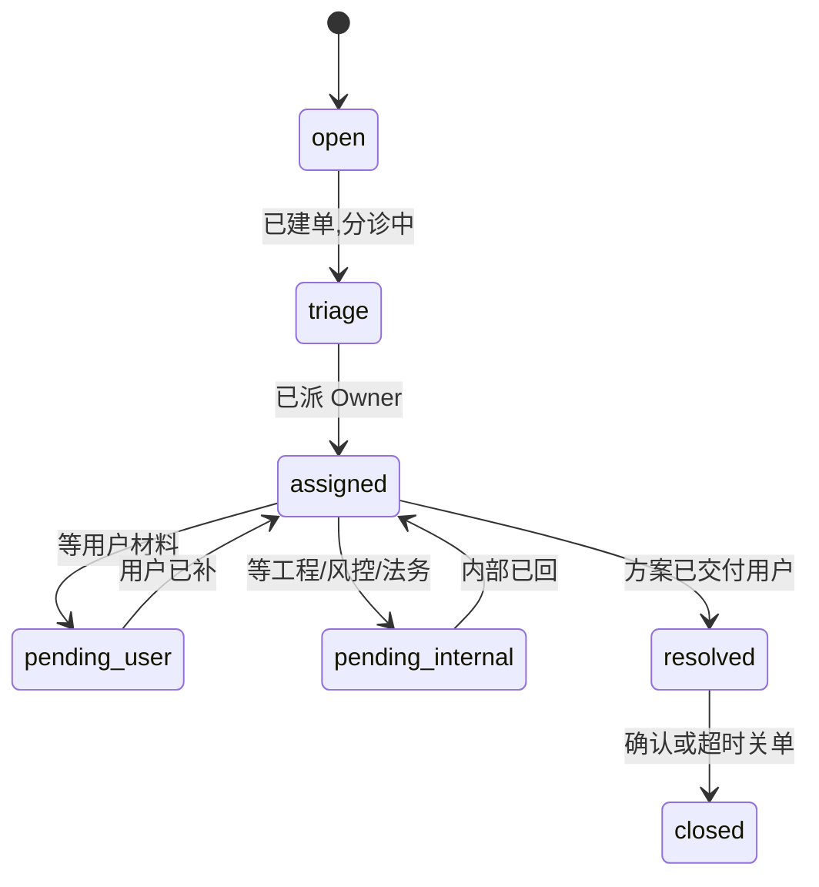

# 用户反馈收集与闭环

## 1. 入口矩阵（须全渠道列清）

| 入口 | **Owner** | **SLA** | **落库位置** |
|------|-------------|--------|----------------|
| **App 内反馈** | **PM-O + CS Lead** | **48h** 首次响应 | **`product-manager/32`** + **`19`** 工单标签 `feedback-app` |
| **邮件 / 客服** | **CS Lead** | **24h**（P0 **4h**） | Zendesk/Intercom **等价** + **`08/meetings/`** 周报摘要 |
| **Discord / 社群** | **Community Mgr** | **72h** 汇总为 **周更** | Notion/飞书 **`#feedback-ingest`** |
| **应用商店** | **PM-O** | **7d** 内分类进 **`04-definition/01`** | REQ-ID 前缀 **`STORE-`** |

> **首响 SLA 数字（L1/L2/L3）** 以 **`../12-org-scaling/03-KPI体系-业务与组织.md` §5** 为 **SSOT**；上表为 **渠道默认**，**冲突时以 §5 分级为准**。

---

## 2. 工单字段 **SSOT**（**全类型统一 · 可进数仓**）

**目的**：**所有** 客服/运营工单 **必须** 含下列 **基线字段**（`snake_case`）；**争议类** 在基线之上 **追加** **`19/02` §2** 字段。BI 与 **`22/02` §3** 指挥台 **只认** 本表键名。

| **字段** | **类型 / 枚举** | **必填** | **说明** |
|----------|-----------------|----------|----------|
| `ticket_id` | string | ✔ | 全局唯一，建议 `TKT-2026-` 前缀 |
| `ticket_type` | enum | ✔ | 与 **`../19-risk-operations/05-客服标准话术-v0.9-按场景.md`** 表 1 对齐；扩展须 **RFC 一行** 进 **`08/`** |
| `priority` | `P0` \| `P1` \| `P2` \| `P3` | ✔ | 与 **`02-Feature优先级调整机制.md`** 语义一致 |
| `sla_tier` | `L1` \| `L2` \| `L3` | ✔ | 对应 **`12/03` §5** 响应时钟 |
| `sla_due_at` | ISO-8601 | ✔ | 由 **开单时间 + tier** 自动算 |
| `owner` | user id / 角色 | ✔ | **单点 Owner**，不得写「群」 |
| `status` | 见 **§2.1**（**主路径 7 态**） | ✔ | **禁止** 自造状态值；看板统计 **只认** §2.1 枚举 |
| `city_id` | e.g. `JP-01` | 区域类 **必填** | 无则填 `GLOBAL` |
| `order_id` | string | 交易类 **必填** | 无则 `null` |
| `created_at` / `updated_at` | ISO-8601 | ✔ | 审计 |

**与争议单关系**：**`ticket_type`** 以 **`../19-risk-operations/05-客服标准话术-v0.9-按场景.md`（话术大全）** 枚举为起点；**`dispute_*`** 须 **同时** 满足 **`19/02` §2**。**不得** 另造一套键名替代本表基线。

### 2.1 **工单状态流转（SSOT · 全仓统一）**

**主路径**（**统计口径** 与 **`22/02` §3.3** 一致）：

| **`status`** | **含义（一线可理解版）** | **谁推进** |
|----------------|---------------------------|------------|
| **`open`** | 刚进线，**未分诊** | 池长 / 系统 |
| **`triage`** | **已分类**（`ticket_type` 已定），**未派** Owner | CS Lead |
| **`assigned`** | **Owner 处理中** | 工单 `owner` |
| **`pending_user`** | **等用户** 补截图/确认 | Owner 发催办 |
| **`pending_internal`** | **等内部**（工程 incident / 法务 / 风控） | Owner 跟催 **+ `engineering_ticket` 等** |
| **`resolved`** | **方案已给用户**（未必关单） | Owner |
| **`closed`** | **归档**（用户确认 / SLA 关单 / 重复单合并） | Owner + CS Lead |

**允许跳转（例外，须写工单备注）**：`open` → `assigned`（**P0** 直接派 on-call）；**`triage` 不得跳过** 除非 **P0** 并备注 **`P0_SKIP_TRIAGE`**。

**与 SLA**：**`sla_due_at`** 在 **`open`/`triage`** 阶段按 **L1** 算；进入 **`assigned`** 后按 **优先级** 换 **L2/L3** 时钟（**`12/03` §5**）。

---

## 3. 闭环

**收集 → 分类（Bug/建议/投诉）→ 优先级（`02`）→ PRD/工单 → 发布说明 → 用户回访**。

## 4. 与现有资料

- **`../product-manager/32-用户反馈与问题闭环台账.md`** — 可继续作执行台账；本文件定义 **机制**。

## 变更记录

| 版本 | 日期 | 说明 |
|------|------|------|
| 0.1.0 | 2026-05-02 | 初版 |
| 0.2.0 | 2026-05-02 | **§1** Owner/SLA/落库 **填实**；链 **`12/03` §3** |
| 0.3.0 | 2026-05-02 | **§2** 工单字段 **SSOT**；§1 链 **`12/03` §5**；原 §3→**§4** |
| 0.4.0 | 2026-05-02 | **§2.1** 状态机 **`open`→`triage`→`assigned`→…**；链 **`22/02` §3.3** |
